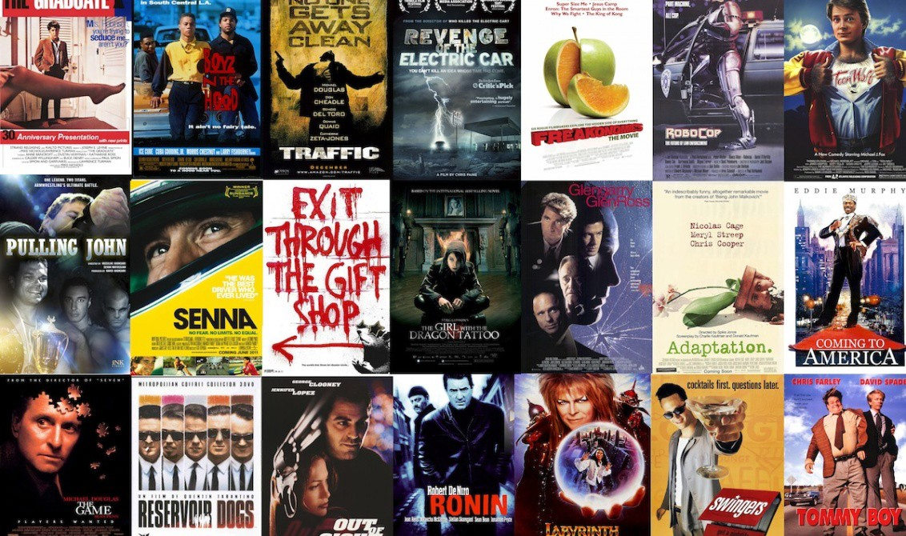
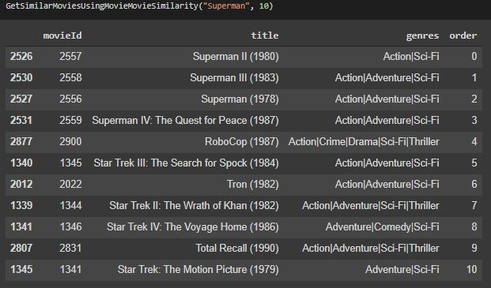
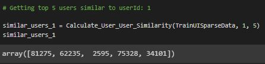
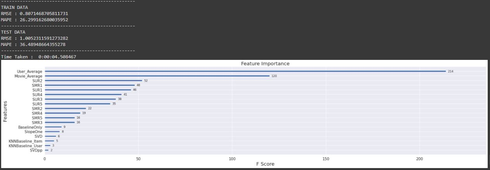
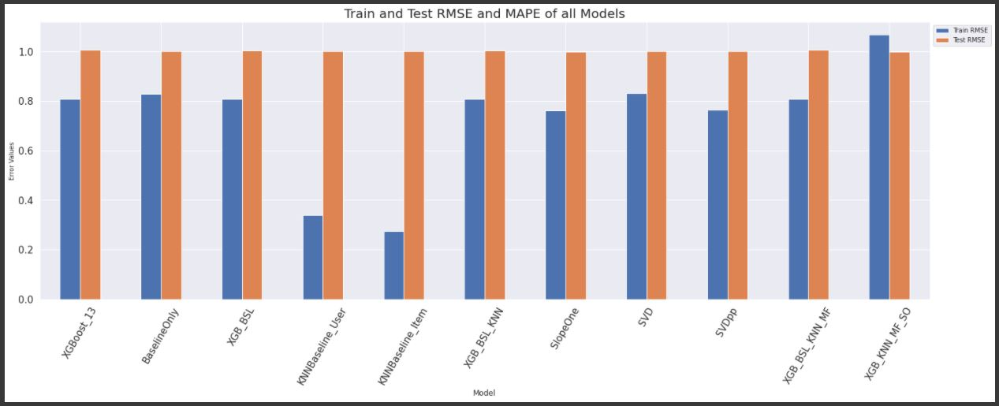
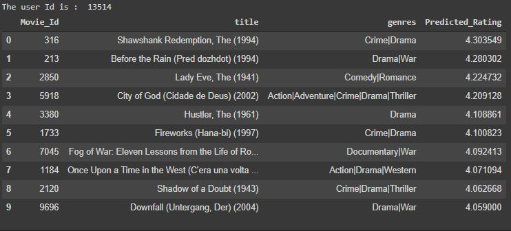

# Movie-Recommendation-System

 

## Business Objectives

All entertainment websites or online stores have millions/billions of items. It becomes challenging for the customer to select the right one. At this place, recommender systems come into the picture and help the user find the right item by minimizing the options.

Recommendation Systems in the world of machine learning have become very popular and are a huge advantage to tech giants like Netflix, Amazon and many more to target their content to a specific audience. These recommendation engines are so strong in their predictions that they can dynamically alter the state of what the user sees on their page based on the user’s interaction with the app.

The business objective for us is:
1. To create a Collaborative Filtering-based Movie Recommendation System
2. Predict the rating that a user would give to a movie that they have not yet rated
3. Minimize the difference between predicted and actual rating (RMSE and MAPE)

## Data Collection

The dataset has been obtained from Grouplens.

**Link:**  
https://grouplens.org/datasets/movielens/20m/

This dataset (**ml-20m**) describes 5-star rating and free-text tagging activity from MovieLens, a movie recommendation service. It contains **20,000,263 ratings** and **465,564 tag applications** across **27,278 movies**. These data were created by **138,493 users** between **January 9, 1995** and **December 31, 2023**. This dataset was last updated on **January 15, 2024**.

Users were selected at random for inclusion. All selected users had rated at least **20 movies**. No demographic information is included. Each user is represented by an anonymous ID, and no other information is provided.

The data are contained in the files:
- `genome-scores.csv`
- `genome-tags.csv`
- `links.csv`
- `movies.csv`
- `ratings.csv`
- `tags.csv`

For our objective, we used the **ratings.csv** and **movies.csv** data files.

## Modelling

The following modelling approach was used in the project:

1. Loading and exploring the movie and user ratings data
2. Creating User-Item Matrix, User-User, and Item-Item similarity matrices for recommendations
3. Creating features and applying ML models to predict the ratings for unseen movies for a user

The detailed analysis and model creation can be found in the `.ipynb` notebook file.

## Results

Some of the test images are given below.

**Results from Movie-Movie Similarity:**

**Results from User-User Similarity:**

**Feature Importance for Predicting Ratings:**

**Results from Different ML Models:**

**Sample Movie Recommendation Based on Collaborative Filtering:**

## Conclusions

In this project, we learned the importance of recommendation systems, the types of recommender systems being implemented, and how to use matrix factorization to enhance a system.

We built a movie recommendation system that considers user-user similarity, movie-movie similarity, global averages, and matrix factorization. These concepts can be applied to any other user-item interaction systems.

We generated recommendations based on similarity matrices and Collaborative Filtering techniques.

We predicted the ratings for movies the user might give based on past rating behaviors and measured accuracy using RMSE and MAPE error metrics.

Surely, there is huge scope for improvement and trying out different techniques and ML/DL algorithms.
